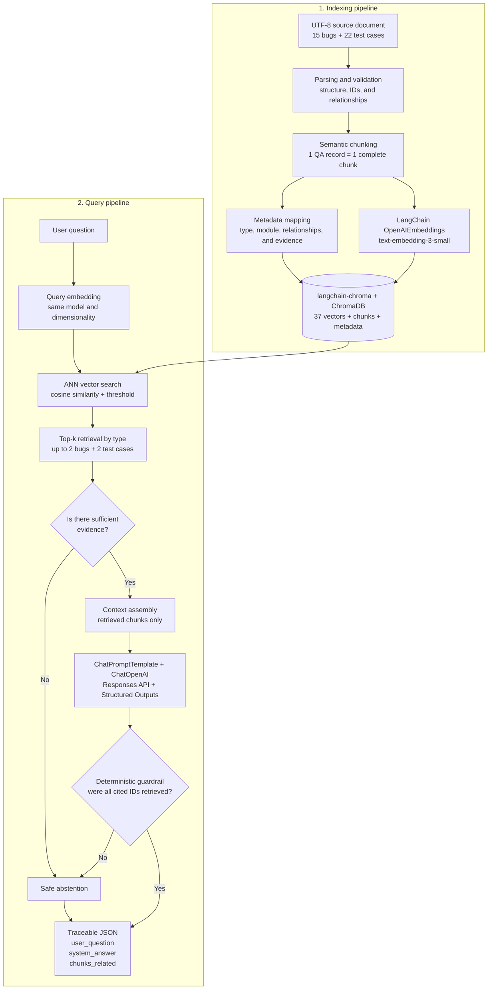

# QA Memory RAG

An educational RAG project that applies historical QA knowledge to a fictional digital bank.
Given a situation, it retrieves existing bug reports and test cases, then returns a traceable
recommendation. It abstains when the evidence is insufficient.

## What it delivers

- A 3,600+ word UTF-8 source with 15 bugs, 22 test cases, and six modules.
- One complete chunk per record, with *evidence-only* technical metadata.
- `text-embedding-3-small` embeddings through LangChain and a local Chroma collection using cosine similarity.
- Up to two bugs and two test cases retrieved per query.
- LangChain orchestration with the Responses API, Structured Outputs, and `gpt-5.4-nano`.
- JSON with exactly `user_question`, `system_answer`, and `chunks_related`.
- Offline tests, a deterministic evaluator, versioned examples, and a [static demo](https://lucasvacis87.github.io/qa-memory-rag/).

## RAG indexing and query flow

The system keeps **indexing** and **querying** separate. It first transforms the source into
persistent vector representations. Later, it converts a question into the same vector space,
retrieves relevant evidence, and only then allows the LLM to compose an answer.



**Chunking** keeps each QA record intact, so its ID, steps, relationships, and evidence are
never separated. **Metadata mapping** adds filterable and traceable fields to each chunk.
**Embeddings** transform records and questions into comparable vectors. `langchain-chroma`
connects the pipeline to ChromaDB, which persists the **vector database** and performs ANN
retrieval using cosine distance. `ChatPromptTemplate` assembles the context, and `ChatOpenAI`
calls the Responses API with structured output. The **LLM** never receives the full source; it
only receives retrieved chunks. Finally, Python validation outside the model blocks IDs that
were not retrieved and forces abstention when an answer is not evidence-based.

### Technology responsibilities

| Technology | Responsibility |
| --- | --- |
| Python | CLI, configuration, domain models, guardrails, and the JSON contract. |
| LangChain | Interfaces and composition for embeddings, retrieval, prompts, and generation. |
| OpenAI | Semantic embeddings and structured generation with the configured model. |
| ChromaDB | Local persistence and vector search filtered by record type. |
| tiktoken | Separate token and cost estimation. |
| pytest | Offline validation with deterministic embeddings and responses. |

## Requirements and setup

- Python 3.12 or 3.13.
- An OpenAI API key with available credit and access to the configured models.

```powershell
python -m venv .venv
.\.venv\Scripts\Activate.ps1
python -m pip install -r requirements.txt
Copy-Item .env.example .env
```

Edit `.env` locally and set `OPENAI_API_KEY`. The default models are already configured, but
you can change them if your account does not have access. The file is ignored by Git. Never
share the key in chat, screenshots, logs, or commits.

`build-index` and `query` use OpenAI and can incur cost. Source validation, tests, sample
generation, and the static demo work without an API key, network access, or API usage.

## Usage

```powershell
python -m src.cli validate-source
python -m src.cli build-index
python -m src.cli query "A rejected transfer deducted the balance" --evaluate
python -m pytest -q
python scripts/generate_samples.py
python -m http.server 8000 --directory docs
```

Indexing reports the chunk count, estimated tokens, and estimated cost. Embedding cost is
calculated separately from generation. Reference prices are centralized in `src/pricing.py`
and should be checked before making paid API calls.

## Project structure

```text
data/faq_document.txt       fictional source data
src/source.py               parser and validation
src/index.py                langchain-chroma, persistence, and retrieval
src/providers.py            LangChain, OpenAI, and offline test doubles
src/rag.py                  pipeline and ID guardrail
src/evaluation.py           deterministic evaluator
src/cli.py                  command-line interface
outputs/sample_queries.json versioned examples
docs/                       architecture and public demo
tests/                      test suite with no API usage
```

## Security and scope

All business content is fictional. The system does not generate new bugs or test cases, does
not use real banking data, and does not expose a public backend. The demo uses precomputed
results and makes no OpenAI calls. A suggested smoke test is always marked as a suggestion
derived from evidence; it is never presented as a historical test case.

The intent is documented in [PROJECT_BRIEF.md](docs/PROJECT_BRIEF.md), the boundaries in
[GUARDRAILS.md](docs/GUARDRAILS.md), the architecture in [ARCHITECTURE.md](docs/ARCHITECTURE.md),
and the original academic brief in [Consignas_proyecto.md](Consignas_proyecto.md).

## Troubleshooting

- `The index does not exist`: run `build-index` with the same configuration.
- `401`: inspect only your local `.env`; never print the key.
- `429` or quota errors: check your balance and limits; do not switch models automatically.
- Model access error: preserve the error and select a different model only through an explicit decision.
- Broken virtual environment: recreate it with an installed Python version; do not reuse paths from a removed installation.
