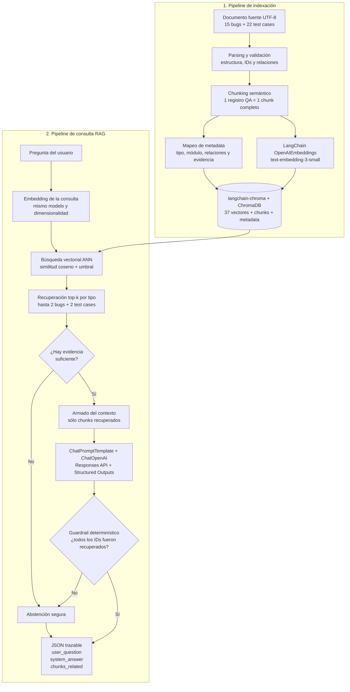

# QA Memory RAG

RAG educativo aplicado a memoria histórica de QA para un banco digital ficticio. Recibe una
situación, recupera bugs y test cases existentes y devuelve una recomendación trazable. Si la
evidencia no alcanza, se abstiene.

## Qué entrega

- Fuente UTF-8 de 3.600+ palabras: 15 bugs, 22 test cases y seis módulos.
- Un chunk completo por registro con metadata técnica *evidence-only*.
- Embeddings `text-embedding-3-small` mediante LangChain y colección Chroma local con similitud coseno.
- Hasta dos bugs y dos test cases por consulta.
- Orquestación LangChain con Responses API, Structured Outputs y `gpt-5.4-nano`.
- JSON con exactamente `user_question`, `system_answer` y `chunks_related`.
- Tests offline, evaluador determinístico, ejemplos y [demo estática](https://lucasvacis87.github.io/qa-memory-rag/).

## Flujo de construcción y consulta del RAG

El sistema separa la **indexación** de la **consulta**. Primero transforma la fuente en
representaciones vectoriales persistentes; después convierte cada pregunta al mismo espacio
vectorial, recupera evidencia relevante y recién entonces permite que el LLM redacte la respuesta.



El **chunking** conserva cada registro QA completo para no separar el ID de sus pasos,
relaciones y evidencia. El **mapeo de metadata** agrega campos filtrables y trazables al chunk.
Los **embeddings** convierten chunks y preguntas en vectores comparables. `langchain-chroma`
conecta el pipeline con ChromaDB, que persiste la **base vectorial** y ejecuta recuperación ANN
con distancia coseno. `ChatPromptTemplate` arma el contexto y `ChatOpenAI` llama explícitamente
a Responses API con salida estructurada. El **LLM** no consulta la fuente completa: recibe
solamente los chunks recuperados. Finalmente, una validación Python ajena al modelo bloquea
IDs no presentes y fuerza una abstención si la respuesta no está fundamentada.

### Responsabilidades de las tecnologías

| Tecnología | Responsabilidad |
| --- | --- |
| Python | CLI, configuración, modelos de dominio, guardrails y contrato JSON. |
| LangChain | Interfaces y composición del pipeline de embeddings, recuperación, prompt y generación. |
| OpenAI | Embeddings semánticos y redacción estructurada con el modelo configurado. |
| ChromaDB | Persistencia local y búsqueda vectorial filtrada por tipo de registro. |
| tiktoken | Estimación separada de tokens y costos. |
| pytest | Validación offline mediante embeddings y respuestas determinísticas. |

## Requisitos e instalación

- Python 3.12 o 3.13.
- Una API key de OpenAI con saldo y acceso a los modelos configurados.

```powershell
python -m venv .venv
.\.venv\Scripts\Activate.ps1
python -m pip install -r requirements.txt
Copy-Item .env.example .env
```

Editá `.env` localmente y reemplazá `OPENAI_API_KEY`. Los modelos predeterminados ya están
configurados; podés cambiarlos si tu cuenta no tiene acceso. El archivo está ignorado por Git.
No compartas la clave por chat, capturas, logs ni commits.

`build-index` y `query` usan OpenAI y pueden generar costo. La validación, los tests, la
generación de muestras y la demo funcionan sin API key, red ni consumo.

## Uso

```powershell
python -m src.cli validate-source
python -m src.cli build-index
python -m src.cli query "Una transferencia rechazada descontó el saldo" --evaluate
python -m pytest -q
python scripts/generate_samples.py
python -m http.server 8000 --directory docs
```

La indexación informa cantidad de chunks, tokens estimados y costo estimado. El costo de
embeddings se calcula aparte de la generación. Los precios de referencia están centralizados
en `src/pricing.py` y conviene verificarlos antes de ejecutar llamadas pagas.

## Estructura

```text
data/faq_document.txt       fuente ficticia
src/source.py               parser y validación
src/index.py                langchain-chroma, persistencia y recuperación
src/providers.py            LangChain, OpenAI y dobles offline
src/rag.py                  pipeline y guardrail de IDs
src/evaluation.py           evaluador determinístico
src/cli.py                  consola
outputs/sample_queries.json ejemplos versionados
docs/                       arquitectura y demo pública
tests/                      suite sin consumo de API
```

## Seguridad y límites

Todo el contenido de negocio es ficticio. El sistema no genera bugs ni casos nuevos, no usa
datos bancarios reales y no publica un backend. La demo contiene resultados precalculados y
no realiza llamadas a OpenAI. Un smoke sólo puede aparecer como sugerencia derivada de la
evidencia; nunca se presenta como test case histórico.

La intención está resumida en [PROJECT_BRIEF.md](docs/PROJECT_BRIEF.md), los límites en
[GUARDRAILS.md](docs/GUARDRAILS.md), la arquitectura en [ARCHITECTURE.md](docs/ARCHITECTURE.md)
y la consigna académica en [Consignas_proyecto.md](Consignas_proyecto.md).

## Troubleshooting

- `El índice no existe`: ejecutá `build-index` con la misma configuración.
- `401`: revisá sólo tu `.env` local; nunca imprimas la key.
- `429` o cuota: verificá saldo/límites y no cambies de modelo automáticamente.
- Modelo sin acceso: conservá el error y elegí otro modelo sólo mediante una decisión explícita.
- Entorno virtual roto: recrealo con el Python instalado; no reutilices rutas de una instalación eliminada.
